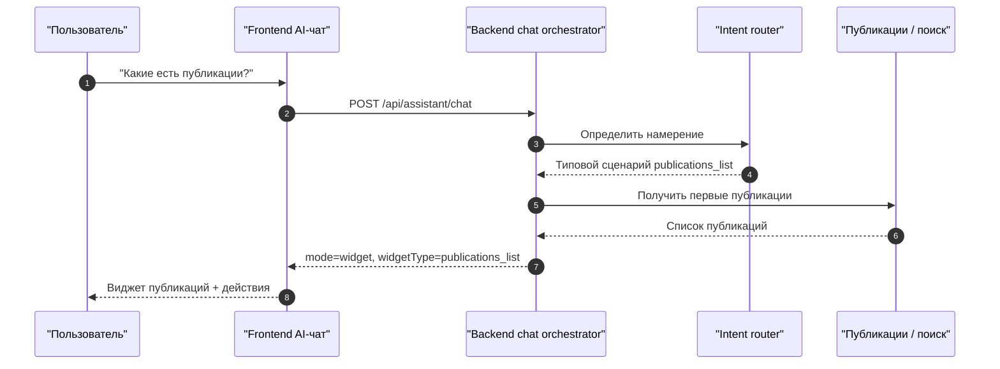
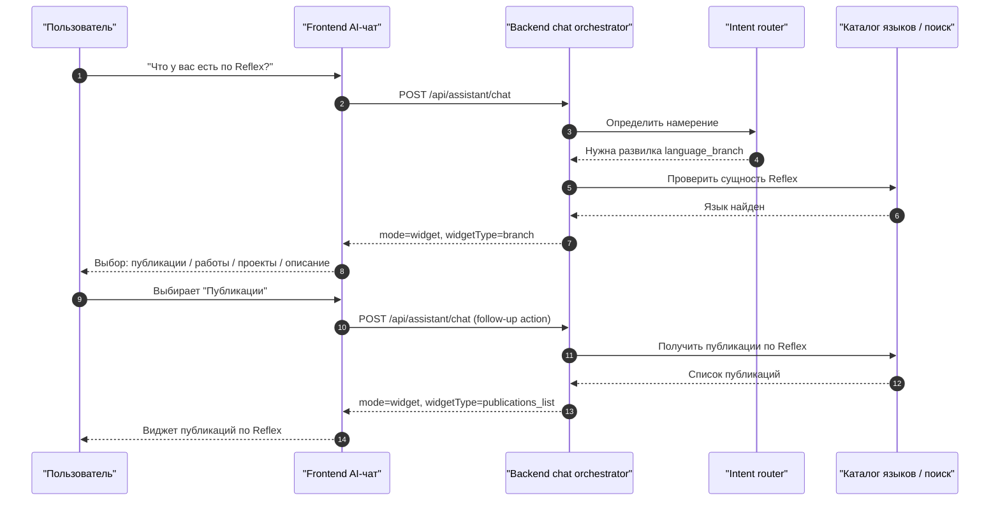
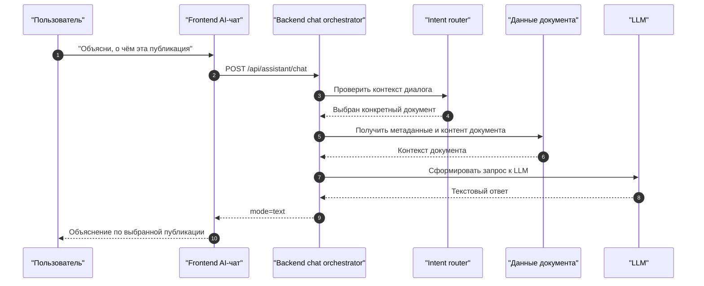
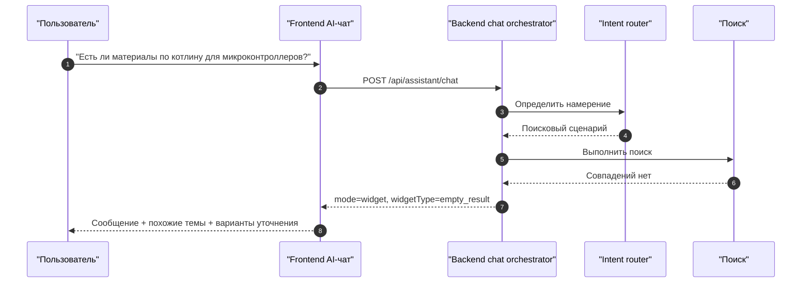
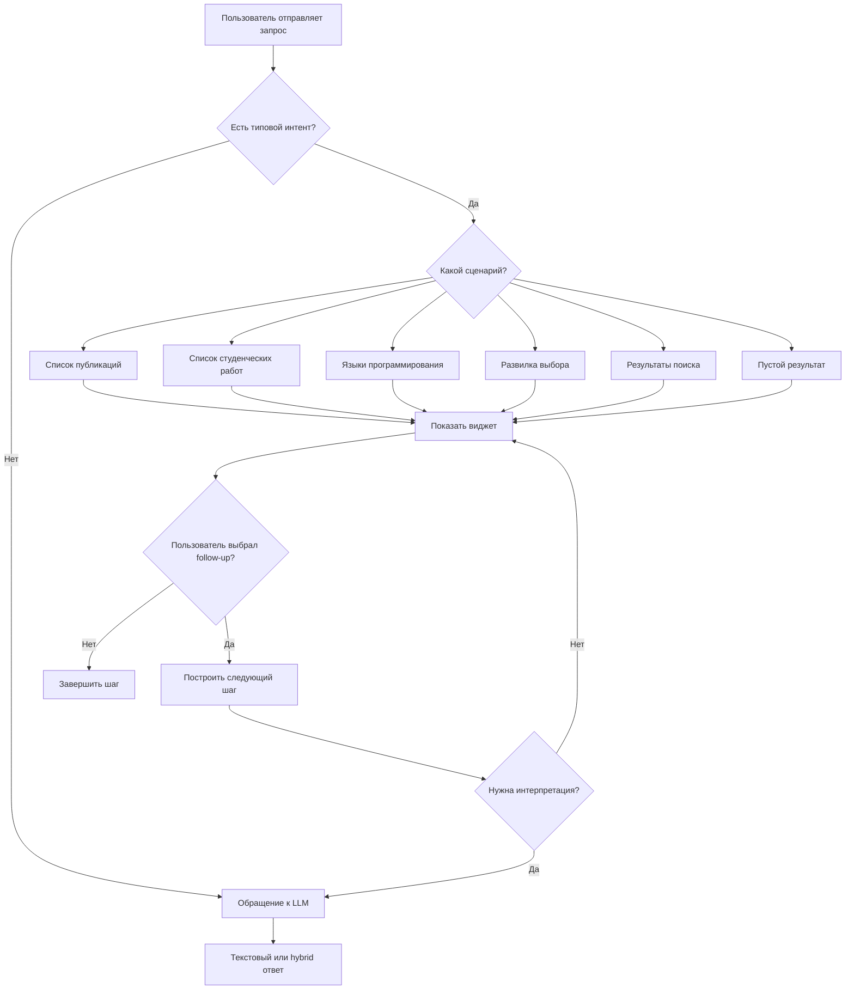

# Требования: визуализация метрик и виджеты быстрых ответов в AI-чате

Документ фиксирует требования к двум связанным направлениям:

1. визуализация продуктовых метрик в служебном интерфейсе;
2. введение структурированных виджетов и быстрых ответов в AI-чате вместо безусловного обращения к LLM для всех запросов.

## 1. Проблема

Сейчас аналитика уже собирается на backend и хранится в базе данных, однако не представлена в удобном визуальном виде для продуктового и административного анализа. Параллельно AI-чат решает слишком разнородные запросы одним и тем же способом: даже в тех сценариях, где можно быстро и надёжно показать готовый список, карточки или выбор вариантов, запрос уходит в генеративный контур.

Это создаёт сразу несколько проблем:

- пользователь получает медленный и избыточно текстовый ответ там, где нужен список или карточка;
- растёт стоимость и латентность AI-контура;
- ухудшается предсказуемость UX;
- теряется возможность управлять диалогом через быстрые развилки и follow-up выборы;
- метрики есть, но не читаются человеком без отдельного технического запроса к API.

## 2. Цели

### 2.1. По визуализации метрик

- дать служебным ролям экран с понятными карточками и графиками;
- не хранить аналитику только в файлах или логах;
- использовать уже готовые backend-агрегации как источник данных;
- сократить время ответа на вопрос «что происходит с продуктом?» до одного экрана.

### 2.2. По AI-виджетам

- перехватывать типовые вопросы до обращения к LLM;
- выдавать быстрые структурированные ответы там, где ответ уже есть в данных портала;
- добавлять развилки в диалоге через выбор пользователя;
- использовать LLM только там, где нужна интерпретация, объяснение, суммаризация или сложный диалог.

## 3. Требования к визуализации метрик

### 3.1. Экран

Должен быть добавлен служебный экран `/admin/metrics`.

Экран доступен только служебным ролям:

- `ADMIN`
- `PM`
- `SUPPORT`
- `DEVOPS`

### 3.2. Источники данных

Экран должен использовать существующие backend-endpoints:

- `/api/metrics/reports/dau-wau`
- `/api/metrics/reports/search-success`
- `/api/metrics/reports/ctr`

При необходимости допустимо расширение backend дополнительными агрегатами, но базовый экран должен быть построен уже на существующем API.

### 3.3. Виджеты метрик

На экране должны быть следующие блоки:

1. карточка `Суточная аудитория`
2. карточка `Недельная аудитория`
3. карточка `Успешность поисковых сессий`
4. карточка `Доля переходов по результатам`
5. график динамики суточной аудитории по дням
6. график динамики успешности поиска по дням
7. столбчатая диаграмма переходов по типам источников
8. таблица последних агрегированных значений по периодам

### 3.4. Элементы управления

На экране должны быть:

- выбор периода: `7 дней`, `14 дней`, `30 дней`, `90 дней`
- кнопка обновления
- состояния `loading`, `empty`, `error`
- человекочитаемые подписи метрик на русском языке

### 3.5. Нефункциональные требования

- экран должен быть адаптивным;
- ключевые карточки должны быть видны без горизонтальной прокрутки;
- визуализация не должна зависеть от внешних BI-систем;
- данные должны браться из PostgreSQL через backend API, а не из файлов.

## 4. Принцип работы быстрых ответов в AI-чате

### 4.1. Общее правило

Перед обращением к LLM должен выполняться слой определения намерения пользователя.

Если намерение относится к одному из типовых сценариев и может быть удовлетворено структурированным ответом из данных портала, чат не должен сразу обращаться к генеративной модели.

Вместо этого должен возвращаться один из виджетов.

### 4.2. Когда использовать виджет, а не LLM

Виджет должен использоваться, если:

- пользователь просит список объектов;
- пользователь хочет выбрать категорию, язык, раздел или тип материалов;
- пользователь спрашивает о наличии сущностей на портале;
- можно показать первые результаты поиска без генерации текста;
- нужна развилка, после которой уже можно строить следующий шаг.

LLM должен использоваться, если:

- нужен развернутый ответ по содержанию документа;
- нужен пересказ, объяснение или сравнение;
- пользователь задаёт сложный вопрос по конкретной публикации или работе;
- структурированного ответа недостаточно.

## 5. Набор обязательных AI-виджетов

### 5.1. Виджет списка публикаций

Триггеры:

- «какие есть публикации»
- «покажи публикации»
- «что есть по публикациям»

Поведение:

- показать первые N публикаций;
- дать фильтры или быстрые переходы;
- дать кнопки:
  - `Открыть публикации`
  - `Показать ещё`
  - `Уточнить тему`

### 5.2. Виджет студенческих работ

Триггеры:

- «какие есть студенческие работы»
- «покажи работы»
- «есть ли проекты студентов»

Поведение:

- показать первые N работ;
- дать группировку по типу проекта;
- дать переход в раздел работ.

### 5.3. Виджет языков программирования

Триггеры:

- «какие языки есть»
- «что есть по Reflex / poST / IndustrialC»
- «покажи языки программирования»

Поведение:

- показать карточки языков;
- дать быстрый выбор языка;
- после выбора предложить следующую развилку:
  - `Публикации`
  - `Студенческие работы`
  - `Проекты`
  - `Общее описание`

### 5.4. Виджет развилки

Используется, если запрос слишком общий и нужно сузить тему.

Примеры:

- пользователь спросил «что у вас есть по Reflex»
- чат возвращает:
  - `Публикации по Reflex`
  - `Студенческие работы по Reflex`
  - `Проекты по Reflex`
  - `Справка по разделу`

### 5.5. Виджет результатов поиска

Используется при явном поисковом запросе.

Должен содержать:

- название результата;
- тип источника;
- короткий фрагмент;
- кнопку открытия;
- кнопку `Спросить AI об этом материале`

### 5.6. Виджет пустого результата

Если точного результата нет, чат должен показать:

- человекочитаемое сообщение;
- похожие варианты;
- кнопки переформулировки запроса.

## 6. Требования к формату ответа AI-чата

Backend AI-слой должен уметь возвращать не только обычный текст, но и структурированный ответ.

Минимальный контракт:

```json
{
  "mode": "widget",
  "widgetType": "publications_list",
  "title": "Публикации",
  "subtitle": "Найдены материалы по запросу",
  "items": [],
  "actions": [],
  "followUpOptions": []
}
```

Поддерживаемые режимы:

- `text`
- `widget`
- `hybrid`

`hybrid` означает: краткий текст + структурированный блок.

## 7. Сценарии быстрых ответов

### 7.1. Список публикаций

Пользователь:
`Какие у вас есть публикации?`

Ответ:

- виджет списка публикаций;
- без немедленного вызова LLM.

### 7.2. Список студенческих работ

Пользователь:
`Есть ли студенческие работы по IndustrialC?`

Ответ:

- сначала быстрый поиск по работам;
- если результаты есть, виджет работ;
- если пользователь просит объяснение конкретной работы, только тогда LLM.

### 7.3. Запрос по языку

Пользователь:
`Что у вас есть по Reflex?`

Ответ:

- виджет развилки;
- пользователь выбирает один из дальнейших путей;
- только после выбора строится следующий ответ.

### 7.4. Уточнение по документу

Пользователь:
`Объясни, о чём эта публикация.`

Ответ:

- если до этого уже выбран конкретный документ, допускается вызов LLM;
- если документ ещё не выбран, сначала нужен виджет выбора.

## 8. Схемы последовательности для AI-чата

### 8.1. Сценарий: публикации без обращения к LLM



### 8.2. Сценарий: развилка по языку и следующий выбор пользователя



### 8.3. Сценарий: переход в LLM после выбора конкретного материала



### 8.4. Сценарий: пустой результат и безопасная переформулировка



## 9. Карта сценариев AI-агента



## 10. Распределение работ по ролям

### 10.1. PM

PM отвечает за:

- матрицу сценариев AI-чата;
- приоритизацию сценариев первой очереди;
- критерии готовности для widget-first поведения;
- согласование метрик для `/admin/metrics`;
- продуктовую проверку того, что типовой запрос не уходит в LLM без необходимости.

### 10.2. Frontend

Frontend отвечает за:

- рендеринг режимов `text`, `widget`, `hybrid`;
- библиотеку виджетов AI-чата;
- обработку follow-up выбора пользователя;
- экран `/admin/metrics`;
- адаптивность и визуальные состояния `loading`, `empty`, `error`.

### 10.3. Backend

Backend отвечает за:

- intent routing до обращения к LLM;
- контракты structured response;
- сценарии `publications_list`, `student_works_list`, `languages`, `branch`, `search_results`, `empty_result`;
- эскалацию в LLM только при необходимости;
- API-агрегации для визуализации метрик.

### 10.4. QA

QA отвечает за:

- тестовую матрицу по каждому сценарию AI-чата;
- проверку, что типовые вопросы не уходят в LLM преждевременно;
- регрессию виджетов, follow-up действий и служебной панели метрик;
- ручные сценарии для empty state, error state и пограничных развилок.

### 10.5. Пользователь-критик

Пользователь-критик отвечает за:

- оценку понятности быстрых ответов;
- проверку, что виджеты не выглядят как технический отладочный интерфейс;
- фиксацию мест, где пользователь ожидает список, а получает лишний текст;
- проверку полезности развилок и подписей действий.

### 10.6. DevOps

DevOps отвечает за:

- CI-проверки фронта и бэка после внедрения нового chat contract;
- smoke-проверку среды, где одновременно доступны frontend, backend и LLM fallback;
- контроль того, что feature не ломает текущие сборки и деплой.

## 11. Требования к аналитике AI-виджетов

Нужно собирать отдельные события:

- `ai_widget_shown`
- `ai_widget_action_clicked`
- `ai_follow_up_selected`
- `ai_escalated_to_llm`
- `ai_empty_result_shown`
- `ai_answer_completed`

Для каждого события должны фиксироваться:

- тип виджета;
- исходный пользовательский запрос;
- выбранное действие;
- была ли эскалация в LLM;
- время до ответа;
- идентификатор сессии;
- роль пользователя, если это служебный режим.

## 12. Минимальный релиз первой очереди

В первую очередь должны быть реализованы:

1. экран `/admin/metrics`
2. виджет публикаций
3. виджет студенческих работ
4. виджет языков программирования
5. виджет развилки
6. backend intent routing для типовых запросов
7. базовая аналитика widget-first сценариев

## 13. Критерии готовности

Функциональность считается готовой, если:

- типовые вопросы о публикациях, студенческих работах и языках не требуют немедленного обращения к LLM;
- пользователь может выбрать следующий шаг прямо в чате;
- AI-чат поддерживает structured payload;
- метрики отображаются в отдельном служебном интерфейсе;
- события использования виджетов записываются в аналитику;
- сценарии покрыты ручными и интеграционными проверками.
